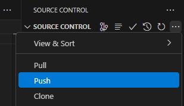

``` text
Nama   : Febrianti Mayori
NIM    : 2241720248
Kelas  : TI-3D
```

# hello_world

A new Flutter project.

## Getting Started

This project is a starting point for a Flutter application.

A few resources to get you started if this is your first Flutter project:

- [Lab: Write your first Flutter app](https://docs.flutter.dev/get-started/codelab)
- [Cookbook: Useful Flutter samples](https://docs.flutter.dev/cookbook)

For help getting started with Flutter development, view the
[online documentation](https://docs.flutter.dev/), which offers tutorials,
samples, guidance on mobile development, and a full API reference.

## Laporan Praktikum
### Praktikum 1
#### Langkah 1
```text
Membuat "Flutter: New Application Project" pada Visual Studio Code.
```


#### Langkah 2
```text
Select a folder to create the project in.
```


#### Langkah 3
```text
Memberikan nama pada project "hello_world". 
```


#### Langkah 4
```text
Project flutter berhasil dibuat.
```


### Praktikum 2 
#### Langkah 1
```text
Membuat repository baru di GitHub.
```


#### Langkah 2
```text
Tampilan awal repository yang telah dibuat.
```


#### Langkah 3
```text
Melakukan inisialisasi git project pada GitHub.
```


#### Langkah 4
```text
Melakukan stages (+) pada file .gitignore untuk mengunggah file pertama ke repository GitHub.
```


#### Langkah 5
```text
Beri pesan commit, lalu klik commit (✔).
```


#### Langkah 6
```text
Lakukan push.
```


#### Langkah 7
```text
Add remote repository Github.
```


#### Langkah 8
```text
Copy paste link repository, lalu klik add remote.
```


#### Langkah 9
```text
Push file readme dengan langkah yang sama seperti langkah 4. 
```


#### Langkah 10
```text
Meakukan push juga untuk semua file lainnya ke repository Github.
```


#### Langkah 11
```text
Mencoba running project hellow_world.
```


#### Langkah 12
```text
Mengubah text dengan nama lengkap dan melakukan debugging pada program.
```


### Praktikum 3
#### Langkah 1: Text Widget
```text
Membuat file baru untuk menampilkan text.
```


#### Langkah 2: Image Widget
```text
Membuat file baru untuk menampilkan gambar.
```


### Praktikum 4
#### Langkah 1: Cupertino Button dan Loading Bar
```text
Membuat widget dengan mengimport class dari material dan cupertino untuk menampilkan button dan loading bar.
```


#### Langkah 2: Floating Action Button (FAB)
```text
Membuat class baru untuk menampilkan Floating Action Button.
```


#### Langkah 3: Scaffold Widget
```text
Membuat scaffold untuk mengatur tata letak sesuai dengan material design.
```


#### Langkah 4: Dialog Widget
```text
Membuat 2 jenis widget dialog (AlertDialog dan SimpleDialog).
```


#### Langkah 5: Input dan Selectoin Widget
```text
Membuat TextField untuk menginputkan teks.
```


#### Langkah 6: Date and Time Pickers
```text
Membuat button untuk menentukan tanggal dan jam.
```


### Tugas Praktikum Soal No. 2
